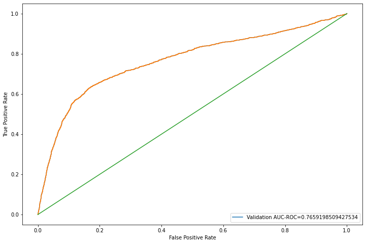
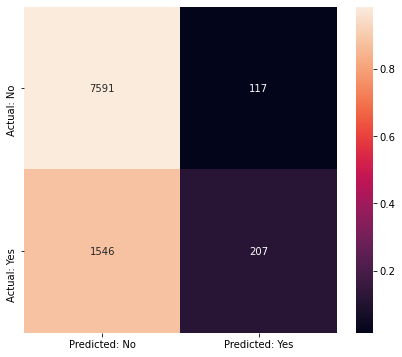
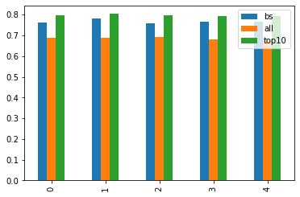

# Customer Churn Prediction

A machine learning project that predicts customer churn using Logistic Regression. This project demonstrates an end-to-end machine learning workflow, including data preprocessing, feature engineering, feature selection, model training, cross-validation, and performance evaluation.

---

## Project Overview

Customer churn prediction helps businesses identify customers who are likely to discontinue a service. By predicting churn in advance, organizations can implement targeted retention strategies and improve customer satisfaction.

In this project, a Logistic Regression model was developed to classify customer churn. The workflow includes data preprocessing, Recursive Feature Elimination (RFE) for feature selection, cross-validation, and model evaluation using multiple classification metrics.

---

## Dataset

- **Source:** Kaggle
- **Domain:** Customer Analytics
- **Task:** Binary Classification

The dataset contains customer demographic information, account details, transaction history, balance information, occupation, and churn status.

---

## Project Workflow

- Data Loading
- Data Cleaning and Preprocessing
- Exploratory Data Analysis
- Feature Encoding
- Feature Scaling
- Train-Test Split
- Logistic Regression Model Training
- Model Evaluation
- Cross Validation
- Recursive Feature Elimination (RFE)
- Feature Ranking and Analysis

---

## Repository Structure

```text
Customer-Churn-Prediction/
│
├── README.md
├── LICENSE
├── requirements.txt
├── .gitignore
├── Customer_Churn_Prediction.ipynb
├── churn_prediction.csv
└── images/
    ├── roc_curve.png
    ├── confusion_matrix.png
    └── model_performance_comparison.png
```

---

## Machine Learning Pipeline

### Data Preprocessing

- Missing value handling
- Categorical variable encoding
- Feature scaling
- Train-test split

### Model

- Logistic Regression

### Feature Selection

- Recursive Feature Elimination (RFE)

### Validation

- Cross Validation

---

## Evaluation Metrics

The model was evaluated using:

- Accuracy
- Precision
- Recall
- F1-Score
- ROC Curve
- AUC Score
- Confusion Matrix

---

## Results & Visualizations

### ROC Curve

<p align="center">
  
</p>

---

### Confusion Matrix

<p align="center">
  
</p>

---

### Model Performance Comparison

<p align="center">
  
</p>

The chart compares the performance of the Logistic Regression model using different feature sets:
- **Baseline Features**
- **All Features**
- **Top 10 Features selected using Recursive Feature Elimination (RFE)**

The model trained using the selected top features achieved the best overall performance across the evaluation metrics.

---

## Top Ranked Features (RFE)

Recursive Feature Elimination (RFE) was used to identify the most influential features for customer churn prediction.

| Rank | Feature |
|-----:|-------------------------------|
| 1 | current_balance |
| 2 | average_monthly_balance_prevQ |
| 3 | occupation_company |
| 4 | average_monthly_balance_prevQ2 |
| 5 | current_month_balance |
| 6 | previous_month_balance |
| 7 | current_month_debit |
| 8 | occupation_self_employed |
| 9 | occupation_salaried |
| 10 | occupation_student |

---

## Key Highlights

- Implemented an end-to-end machine learning pipeline for customer churn prediction.
- Applied data preprocessing, feature encoding, and feature scaling.
- Used Logistic Regression for binary classification.
- Performed Recursive Feature Elimination (RFE) for feature selection.
- Evaluated model performance using ROC Curve, Confusion Matrix, Accuracy, Precision, Recall, and F1-Score.
- Validated model performance using Cross Validation.

---

## Tech Stack

- Python
- Pandas
- NumPy
- Scikit-learn
- Matplotlib
- Seaborn
- Jupyter Notebook

---

## Future Improvements

- Compare multiple machine learning algorithms.
- Perform hyperparameter tuning.
- Explore ensemble learning techniques.
- Deploy the model as a web application using Streamlit or Flask.

---

## License

This project is licensed under the MIT License. See the **LICENSE** file for details.
